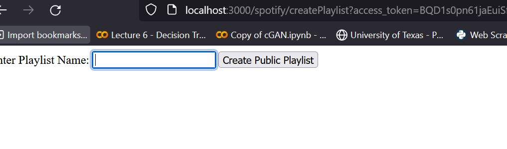

### Type of Change

- [ ] Bug fix (non-breaking change which fixes an issue)
- [X] UI change/fix (doesn't break core functionality that changes how app looks)
- [X] New feature (non-breaking change which adds functionality)
- [ ] Breaking change (fix or feature that would cause existing functionality to change)
- [X] Code style update (formatting, renaming)
- [X] Refactoring (no functional changes, no API changes)
- [X] Build related changes
- [X] Documentation content changes

### Proposed Changes

**What is the current behavior?**  
The project structure and file hierarchy have been restructured to improve organization and maintainability. Additionally, the project includes functionality for integrating with the Spotify Web API using OAuth 2.0 for user authentication and authorization.

**What is the new behavior?**  
The files and directories have been rearranged to have a clearer separation of concerns and to follow best practices for project structure. The project now includes features for:
- Authenticating users with Spotify OAuth 2.0 and redirecting to the Spotify authentication page.
- Fetching user playlists from the Spotify API.
- Allowing users to name new playlists and redirecting them to the Spotify webpage showing the generated playlist.

**If this PR introduces a breaking change, what changes might users need to make in their application due to this PR?**  
There are no breaking changes introduced by this PR. Users should not need to make any changes to their applications.

### Screenshots
# Screenshot of the root directory showing various folders and files

# Screenshot of the Spotify login page with a user logging in.

# Screenshot of a list of user's playlists displayed on the Spotify app.

# Screenshot showing the option to title a copy of a playlist on Spotify

# Screenshot of the webpage displaying the newly created playlist on Spotify.

**CI/CD Changes**

<Describe any changes related to Continuous Integration/Continuous Deployment>

**PR Template Changes**

<Describe any changes made to this pull request template>

### Comments/Questions from the Author
N/A

### Self-Review Checklist

- [ ] I have added unit and/or integration tests to cover my changes, or my changes did not require additional tests.
- [ ] All new and existing tests passed on my local machine.
- [X] I did not add unnecessary comments to the code.
- [X] I did not add unnecessary logging or debugging code (print statements, for example).
- [X] Errors are properly handled for code that is risky.
- [X] Naming of methods, variables, and classes is proper.
- [X] I wrote a description of requested changes.
- [X] I performed a self-review of my own code.